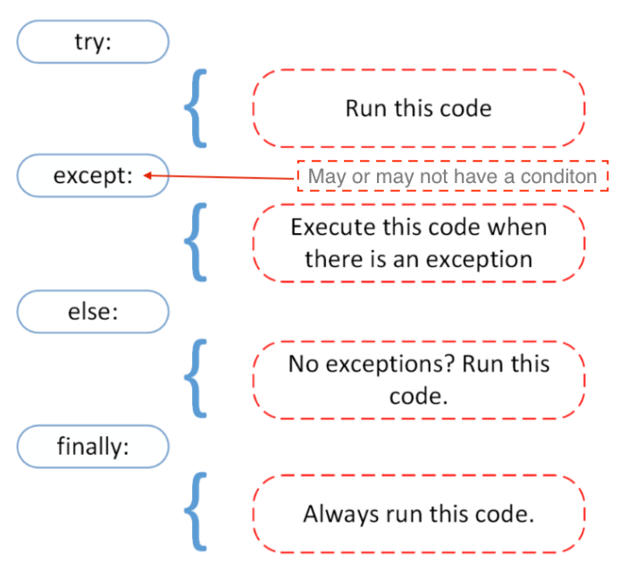

This is a few days of me learning the python basic again instead of doing an actual project. Basically back to basic.

Source:
- [30 days of python](https://github.com/Asabeneh/30-Days-Of-Python) (only until day 21, day 22 - 30 in new repo).
- [Decorators](https://stackoverflow.com/a/1594484).
- [Ternary Operator in Python](https://www.geeksforgeeks.org/ternary-operator-in-python/).
- [`super()` Inheritance](https://www.geeksforgeeks.org/python-super-in-single-inheritance/).

README Contents:
- [Data Types](#data-types-in-python).
- [Sequential Flow](#sequential-flow-of-execution).
- [Function](#function).
- [Difference Between Method and Function](#the-difference-between-method-and-function).
- [Error Types](#python-error-types).
- [Try and Except](#try-and-except).
- [Regular Expresion](#regular-expresion).
- [File Handling](#file-handling).
- [JSON to Dictionary and Vice Versa](#json-to-dictionary-and-vice-versa).
- [PIP](#pip).
- [Create A Package](#creating-a-package).
- [Classes and Objects](#classes-and-objects).
- [Side Notes](#side-notes).

Repo Contents:
- [Day 1 - operators](day-01).
- [Day 2 - string and number table](day-02).
- [Day 3 - list](day-03),
- [Day 4 - dictionary, set, and tuple](day-04).
- [Day 5 - list with if](day-05).
- [Day 6 - for and while looping](day-06).
- [Day 7 - decorators, lambda, def, closures, map, and reduce](day-07).
- [Day 8 - datetime, date, strftime, timedelta, and time](day-08).
- [Day 9 - regular expresion, spreading, unpack arguments, unpack dictionary, and zip](day-09).
- [Day 10 - file handling, json to dictionary and vice versa](day-10).
- [Day 11 - create package, webbrowser module, and requests module](day-11).
- [Day 12 - init constructor, object methods, inheritance](day-12).

---

### Data Types in Python
There're four collection data types in python:
- List: A collection which is ordered and changeable (modifiable). Allows duplicate members.
- Tuple: A collection which is ordered and unchangeable or unmodifiable. Allows duplicate members.
- Set: A collection which is unordered, unindexed, unmodifiable but you can add new items. No duplicate members.
- Dictionary: A collection which is unordered, changeable (modifiable), and indexed. No duplicate members.

---

### Sequential Flow of Execution
If the processing logic require so, the sequential flow of execution can be altered in two way:
- Conditional execution: a block of one or more stetements will be executed if a certain expression is true.
- Repertitive execution: a block of one or more statements will be repetitively executed as long as a certain expression is true.

---

### Function
Function can perform these following operations:
- a function can take one or more functions as parameters
- a function can be returned as a result of another function
- a function can be modified
- a function can be assigned to a variable

Decorators allow us to wrap another function in order to extend the behavior of wrapped function, without permanently modifying it. <br>
Syntax:

```python
@wrapper
def function(n):
    statements(s)
```

That's similar to:

```python
def function(n):
    statement(s)

variable = wrapper(function)
```

---

### The Difference Between Method and Function

1. Function and method both look similar as they perform in almost similar way, but the key difference is the concept of **Class and its Object**.
2. Funciton can be called **only by its name**, as it is defined independently. But methods **can't be called by its name only**, we need to invoke the class by a reference of that class in which it is defined. <br>
i.e. **method is defined within a class and hence they are dependent on that class**.

---

### Python Error Types

- SyntaxError: the syntax was wrong.
- NameError: variable name not defined.
- IndexError: usually index out of range (print index length first to check).
- ModuleNotFoundError: there's no such module.
- AttributeError: the module doesn't have such attribute or function.
- KeyError: basically a typo.
- TypeError: different data type (convert the data type first).
- ImportError: there's no such function in the module.
- ValueError: there's a problem with the value (whether it's not supported or something else).
- ZeroDivisionError: cannot divide a number by zero.

**ImportError: cannot import name 'datetime' from partially initialized module 'datetime' (most likely due to a circular import)** >> that happens because of the file name the same as the module name.

---

### Try and Except



To analyze the problem, we can use different error types with except. For example: <br>
```python
try:
    print 'hello word'

except SyntaxError:
    print('the syntax is wrong')

else:
    print('forget about it')

finally:
    print('it is over')
```

---

### Regular Expressions

A regular expression or RegEx is a special text that helps to find patterns in data.

A RegEx can be used to check if some pattern exists in a different data type. To use RegEx in python first we should import the RegEx module which is called `re`.

#### Function in `re` Module

- `re.match()`: search *only in the beginning of the first line* of the string and returns matched objects if found, else returns none.
- `re.search`: return a match object if there is one anywhere in the string, including multiline strings.
- `re.findall`: return a list containing all matches.
- `re.split`: takes a string, splits it at the match points, returns a list.
- `re.sub`: replaces one or many matches within a string.

Example Syntax:

```python
re.match(substring, string, re.I)
#substring is a pattern
#string is the text we look for the pattern
#re.I is case ignore flag (ignore uppercase or lowercase)
```

For more info about RegEx or `re` module, you can check [here](https://github.com/Asabeneh/30-Days-Of-Python/blob/master/18_Day_Regular_expressions/18_regular_expressions.md#writing-regex-patterns).

---

### File Handling

File handling is an import part of programming which allows us to create, read, update, dan delete files.

In python, to handle data we use `open()` built-in function.

```python
open('filename', mode)
#mode (r, a, w, x, t, b) could be to read, write, update.
```

`open()` function mode:
- `r`: open file for reading, error if the file does not exist.
- `a`: open file for appending, creates the file if it does not exist.
- `w`: open file for writing (overwrite the content of the file), creates the file if it does not exist.
- `x`: create specified file, returns an error if the file exist.
- `t`: text mode, basically it's a default mode (read and write string from and to file which are encoded in a specific encoding if specified, if not, the default is platform dependent).
- `b`: binary mode, the data is read and written in the form of bytes objects. This mode should be used for all files that don't contain text (e.g. images).
- `+`: open for updating (reading and writing).

The default mode of `open` is reading, so we don't have to specify `r` or `rt`.

Opened file has different reading method:
- read()
- readline()
- readlines()

An opened file has to be closed with `close()` method.

Another way to open a file:

```python
with open('./files.txt') as f:
    lines = f.read().splitlines()
    print(lines)
```

---

### JSON To Dictionary and Vice Versa

> JSON stands for JavaScript Object Notation.

JSON must be using double quotes, for example: <br>
```python
person_json = '''{
    "name": "Robertus",
    "skills": ["python", "adobe lightroom", "adobe photoshop"]
    }'''
```

syntax to convert dictionary to json: <br>
```python
json_file = json.dums(dictionary, indent=4) #indent could be 2, 4, 8, and so on. It can beautifies the json.
```

> CSV stands for Comma Separated Values. CSV is a simple file format used to store tabular data, such as a spreadsheet or database.

> XML is another structured data format which looks like HTML.

For more info about XML, you can check [here](https://docs.python.org/2/library/xml.etree.elementtree.html).

---

### PIP

> PIP stands for Preferred Installer Program.

> Package is a python module that can contain one or more modules or other packages. A module or modules that we can install to our application is a package.

For example using web browser module: <br>
```python
import webbrowser

url = 'https://bruhtus.github.io'

webbrowser.open_new_tab(url)
```

For brief info about PIP, you can check [here](https://github.com/Asabeneh/30-Days-Of-Python/blob/master/20_Day_Python_package_manager/20_python_package_manager.md).

> API stands for Application Program Interface. It is a means to exchange structured data between servers primarily as json data.

To open a network connection, we need a package called `requests`, it allows to open a network connection and to implement CRUD (Create, Read, Update, and Delete) operations.

We will see `get`, `status_code`, `headers`, `text`, and `json` methods in `requests` module:
- `get()`: to open a network and fetch data from url (it returns a response object).
- `status_code`: after we fetched data, we can check the status of the operation (success, error, etc).
- `headers`: to check the header types.
- `text`: to extract the text from the fetched response object.
- `json`: to extract json data.

---

### Creating A Package

> A module can contain one or more relevant modules. A package is actually a folder containing one or more module files.

The package folder contains a special file called `__init__.py` (it stores the package's content). If we put `__init__.py` in the package folder, python start recognizes it as a package.

The `__init__.py` exposes specified resources from its modules to be imported to other python files. An empty `__init__.py` file makes all functions available when a package is imported.

The example of folder structure of python package: <br>
```sh
─ mypackage
    ├── __init__.py
    └── module.py
```

---

#### Further Information About Packages

- Database:
    - SQLAlchemy or SQLObject: Object oriented access to several different database systems. `pip install SQLAlchemy`.

- Web Development:
    - Django: High-level web framework. `pip install django`.
    - Flask: Microframework for python based on werkzeug, jinja 2. `pip install flask`.

- HTML Parser:
    - Beautiful Soup: HTML/XML parser designed for quick turnaround projects like screen-scraping, will accept bad markup. `pip install beautifulsoup4`.
    - PyQuery: implement jQuery in python; faster than BeautifulSoup apparently (who knows).

- XML Processing:
    - ElementTree: The element type is a simple but flexible container object, designed to store hierarchical data structures such as simplified XML infosets in memory.

- GUI:
    - PyQt: Bindings for the cross-platform Qt framework.
    - TkInter: The traditional python user interface toolkit.

- Data Analysis, Data Science, and Machine Learning:
    - Numpy (numeric python): Known as one of the most popular machine learning library in python.
    - Pandas: A machine learning library in python that provides data structures of high-level and a wide variety of tools for analysis.
    - SciPy: A machine learning library for application developers and engineers. SciPy library contains modules for optimazation, linear algebra, integration, image processing, and statistics.
    - Scikit-Learn: It is NumPy and SciPy.
    - Tensorflow: A machine learning library built by Google.
    - Keras: Provides an easier mechanism to express neural networks, also provides some of the best utilities for compiling models, processing datasets, visualization of graphs, and much more.

- Network:
    - requests: A package which we can use to send requests to a server (get, post, delete, put). `pip install requests`.

---

### Classes and Objects

> Python is an object oriented programming language. Everything in python is an object with its properties and methods. A class is like an object constructor or a "blueprint" for creating objects. We instantiate a class to create an object. The class defines attributes and the behavior of the object, while the object on the other hand, represents the class.

Class name should be `CamelCase`.

Like the constructor function in java or javascript, python has also a build-in **init()** constructor function.

the `__init__` constructor function has self parameter which is a reference to the current instance of the class.

#### Inheritance

> Using inheritance we can re-use parent class code. Inheritance allows us to define a class that inherits all the methods and properties from another class.

The parent or super or base class is the class which gives all the methods and properties. The child class is the class that inherits from another class.

If we didn't call `__init__` constructor in the child class, we still can access all the properties from the parent. But if we do call the constructor, we can access the parent properties by calling `super`.

We can add a new method to the child or we can overwrite the parent class by creating the same method name in the child class.

When we add the `__init__` function, the child class will no longer inherit the parent's `__init__` function.

There's this error `SyntaxError: non-default argument follows default argument` when you not give default value for all the argument. Example to produce that error: <br>
```python
class student(person):
    def __init__(self, firstname='Robertus', lastname, gender, age, country, city):
        self.gender = gender
        super().__init__(firstname, lastname, age, country, city)
```

---

### Side Notes
Using `*` means there's only one value (it basically save all the arguments into a tuple), that's why args using only `*` and the syntax be like `*args`. Using `**` means there're two value or to be precise a key and a value (it's basically save all the arguments into dictionary), that's why kwargs and dict using `**` and the syntax be like `**kwargs` and `**dict`. (args = arguments, kwargs = keyword arguments).

If we're interested in an index of a list, we use `enumerate`.

Use `zip` to combine lists when looping through them.

Function is a reuseable block of code or programming statements  designed to perform a certain task.

To define a function, python provides the `def` keyword. The function block of code is executed only if we call it.

Function can also return values, if a function does not return any, the value of the function is none.

If we don't know the number of arguments we pass to our function, we can create a function which can take arbitrary number of arguments by adding `*` before the parameters name.

A module is a file containing a single variable, or a function, or a big code base.

Lambda function is a small anonymous function without a name. It can take any number of arguments but can only have one expression. We need it when we want to write an anonymous function inside another function.

The differnce between `lambda` and `def` is that `def` used to define normal functions (need name) and `lambda` used to define anonymous functions (doesn't need a name).

---
